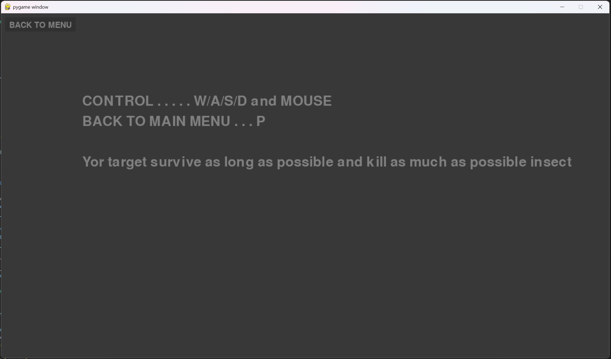

# Insect Game

<p align="center">

</p>

##### Yor target survive as long as possible and kill as much as possible insect

---
## Game screenshots

<table align="center" style="border-spacing: 20px;">
  <tr>
    <td align="center">
      
    </td>
    <td align="center">
      
    </td>
    <td align="center">
      
    </td>
  </tr>
</table>

---

## How to run?

```bash
git clone https://github.com/h128bit/InsectGame
cd InsectGame
pip install pygame
python Main.py
```

#### Enjoy the game